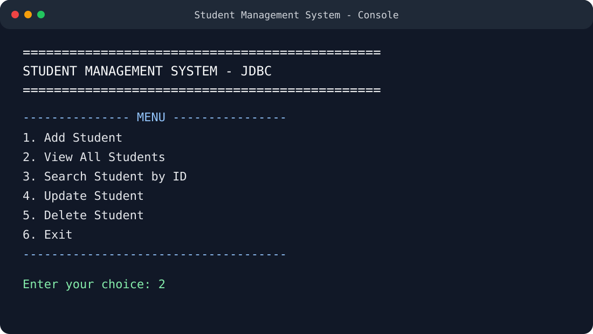
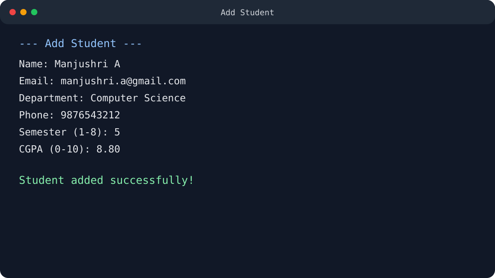
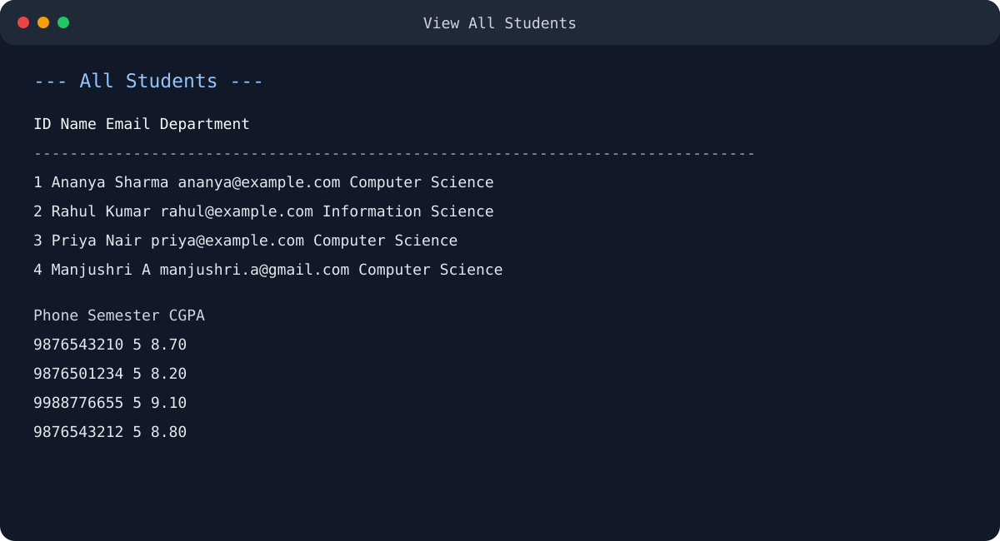
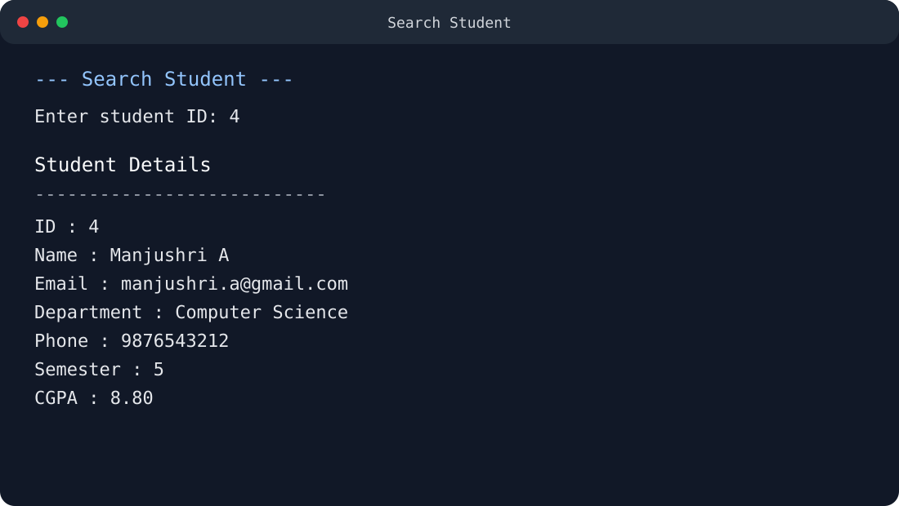
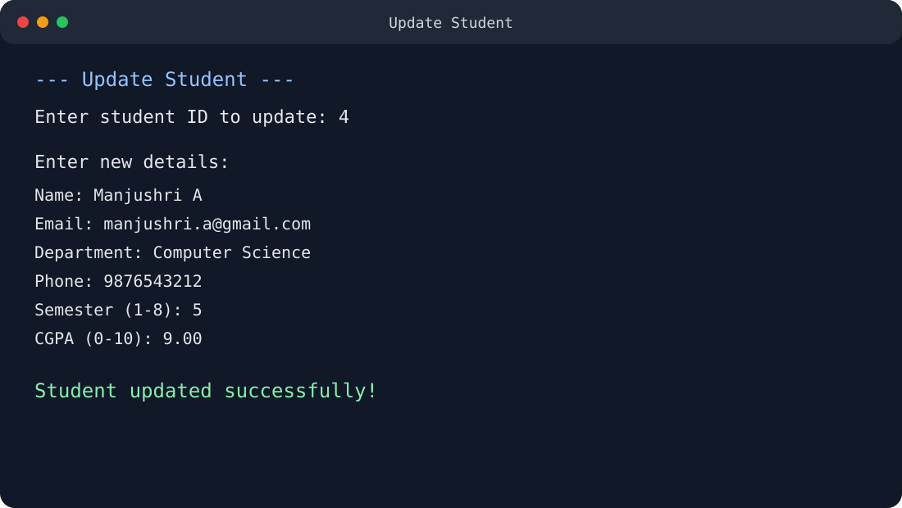
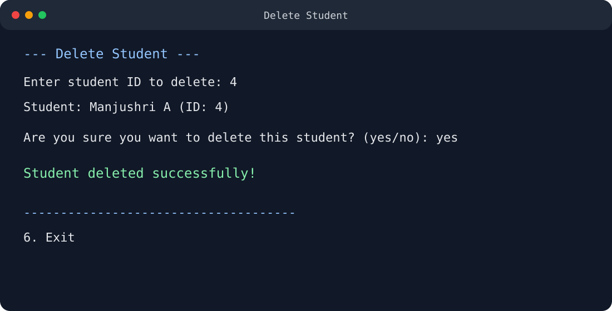

# 🎓 Student Management System using JDBC

A clean, beginner-friendly **Student Management System** built with **Java, JDBC, MySQL and Maven**. The project demonstrates how a Java application connects to a relational database and performs complete CRUD operations.

> **Academic Assignment — Module 3**

## ✨ Features

- ➕ Add a student
- 👀 View all students
- 🔍 Search student by ID
- ✏️ Update student details
- 🗑️ Delete student with confirmation
- ✅ Input validation for semester and CGPA
- 🔐 `PreparedStatement` for parameterized SQL
- ♻️ Try-with-resources for safe JDBC resource handling
- 🧩 DAO pattern for separating database logic from the console UI

## 🛠️ Technologies Used

| Technology | Purpose |
|---|---|
| Java 17+ | Application logic |
| JDBC | Java-to-MySQL connectivity |
| MySQL | Database |
| Maven | Dependency management and build |
| Eclipse / IntelliJ / VS Code | Development |

## 📁 Project Structure

```text
Student-Management-System-JDBC/
├── src/main/java/com/manjushri/sms/
│   ├── DBConnection.java
│   ├── Student.java
│   ├── StudentDAO.java
│   └── StudentManagementSystem.java
├── database/
│   └── student_management.sql
├── screenshots/
│   ├── 01-main-menu.svg
│   ├── 02-add-student.svg
│   ├── 03-view-students.svg
│   ├── 04-search-student.svg
│   ├── 05-update-student.svg
│   ├── 06-delete-student.svg
│   └── README.md
├── pom.xml
├── README.md
└── .gitignore
```

## 🗄️ Database Setup

1. Install and start **MySQL Server**.
2. Open MySQL Workbench or the MySQL command line.
3. Open `database/student_management.sql` from this project.
4. Execute the script.
5. It creates the `student_management` database, the `students` table, and sample records.

The table contains:

```text
id | name | email | department | phone | semester | cgpa
```

The sample insert uses `INSERT IGNORE`, so the same sample email records can safely be encountered again without creating duplicate rows.

## 🔐 Configure Database Credentials

Open:

```text
src/main/java/com/manjushri/sms/DBConnection.java
```

Set your local MySQL credentials:

```java
private static final String USER = "root";
private static final String PASSWORD = "YOUR_MYSQL_PASSWORD";
```

Replace `YOUR_MYSQL_PASSWORD` with your **local** MySQL password.

⚠️ **Never commit your real database password to GitHub.** For a classroom/local run, keep your credentials local and use a safer environment-variable configuration if the project is deployed.

## ▶️ Run with Maven

From the project root:

```bash
mvn clean compile
mvn exec:java
```

The Maven project includes the MySQL Connector/J dependency, so Maven downloads the JDBC driver automatically.

## ▶️ Run from an IDE

1. Import the project as an **Existing Maven Project**.
2. Wait for Maven dependencies to finish downloading.
3. Configure the MySQL username/password in `DBConnection.java` locally.
4. Run:

```text
StudentManagementSystem.java
```

## 🖥️ Application Menu

```text
==============================================
       STUDENT MANAGEMENT SYSTEM - JDBC
==============================================

--------------- MENU ----------------
1. Add Student
2. View All Students
3. Search Student by ID
4. Update Student
5. Delete Student
6. Exit
-------------------------------------
```

## 🔄 CRUD Flow

```text
User
  ↓
StudentManagementSystem
  ↓
StudentDAO
  ↓
JDBC / PreparedStatement
  ↓
MySQL students table
```

### Add
`INSERT INTO students ...`

### View
`SELECT * FROM students ...`

### Search
`SELECT * FROM students WHERE id = ?`

### Update
`UPDATE students SET ... WHERE id = ?`

### Delete
`DELETE FROM students WHERE id = ?`

## 🧠 JDBC Concepts Demonstrated

- `DriverManager.getConnection()` — establishes the database connection
- `Connection` — communicates with MySQL
- `PreparedStatement` — executes parameterized SQL safely
- `ResultSet` — reads data returned by SELECT queries
- `executeUpdate()` — handles INSERT, UPDATE and DELETE
- `executeQuery()` — handles SELECT
- Try-with-resources — closes JDBC resources automatically
- DAO pattern — separates database operations from UI logic

## 📸 Output Preview

The repository contains six **sample output previews** showing the expected console flow:

### Main Menu


### Add Student


### View All Students


### Search Student


### Update Student


### Delete Student


> These are **output previews**, not claims of a run on the repository owner's computer. For a final college submission, they can be replaced with screenshots captured from the locally running application.

## 📌 Expected Test Flow

Use the sample database records to test **View** and **Search** first. Then test the complete CRUD flow:

```text
1 → Add Student
2 → View All Students
3 → Search Student by ID
4 → Update Student
5 → Delete Student
6 → Exit
```

## 🎓 Academic Note

This project was created for a **Module 3 assignment: Create a Student Management System using JDBC**.

**Repository:** Student-Management-System-JDBC
